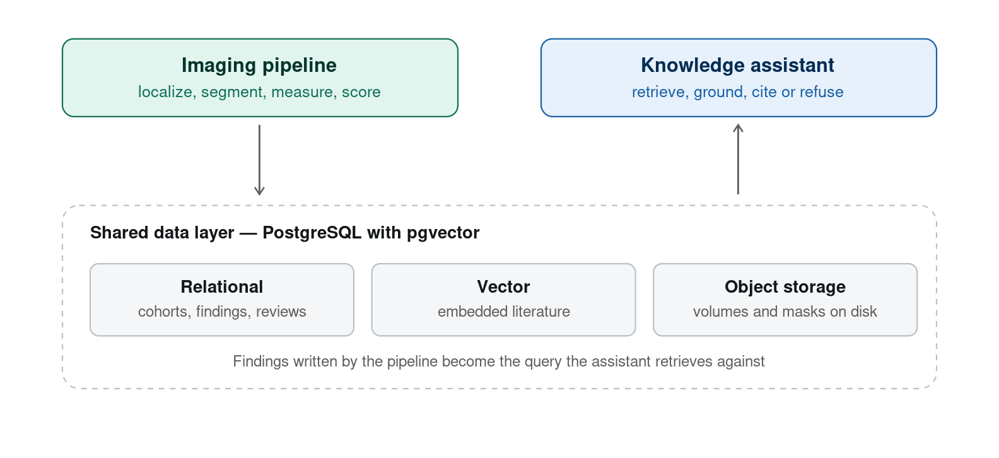
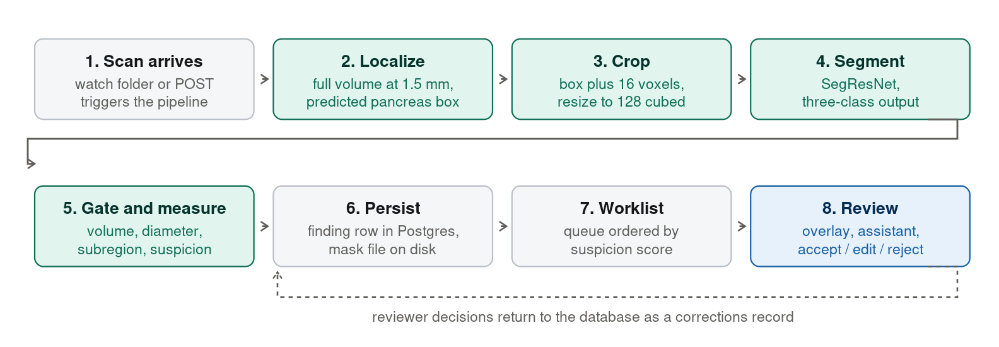

# Technical Appendix

**Autonomous Pancreatic Lesion Detection and Radiologist Review System**

**Quinn Evans** · Supplement to the BSAAI Capstone Proposal · Version 2

This appendix documents the system design and the data behind the proposal. It exists so a reviewer can assess whether the architecture has been thought through, not only whether the technologies have been named. Every quantity was measured against real files or taken from published documentation; estimates are labeled as such.

---

## A1. System architecture

The project consists of two systems that meet at a shared data layer. The imaging pipeline produces structured findings; those findings become the retrieval context for the knowledge assistant. Neither system calls the other directly.



---

## A2. End-to-end data flow

The complete path a scan takes. Steps 2 through 5 are the autonomous cascade this capstone builds; today step 2 is replaced by a human-provided region of interest.



**Measured inference cost.** A full CT resampled to 1.5 mm isotropic is a median of 253 × 190 × 142 voxels — 6.9 million voxels, 26.5 MiB as float32, computed across all 9,901 scans. Sliding-window localization at 128³ with 50% overlap requires a median of 12 windows per scan. Against a current serving time of roughly 0.6 seconds for the provided-region path, autonomous whole-scan inference should land in the range of several seconds per study.

---

## A3. Relational schema

Abbreviated to the tables that carry the design decisions.

```sql
-- Storage roots are configuration, never absolute paths in data.
CREATE TABLE storage_root (
    id    SERIAL PRIMARY KEY,
    name  TEXT NOT NULL UNIQUE,          -- 'cold_archive', 'warm_cache'
    tier  TEXT NOT NULL CHECK (tier IN ('cold','warm','cloud'))
);

CREATE TABLE scan (
    id              BIGSERIAL PRIMARY KEY,
    case_id         TEXT NOT NULL,
    source_dataset  TEXT NOT NULL,        -- 'pants' | 'panorama'
    patient_key     TEXT NOT NULL,        -- splits group on THIS, not on scan
    shape           INT[3]  NOT NULL,
    spacing         REAL[3] NOT NULL,
    contrast_phase  TEXT,
    reference_std   TEXT,                 -- histopathology | cytology | radiology | ...
    site            TEXT,
    UNIQUE (source_dataset, case_id)
);

-- Provenance is data, not an assumption. PANORAMA organ masks are machine
-- generated; PanTS masks are expert validated. The model must know which.
CREATE TABLE annotation (
    id          BIGSERIAL PRIMARY KEY,
    scan_id     BIGINT NOT NULL REFERENCES scan(id),
    structure   TEXT   NOT NULL,          -- 'pancreas' | 'lesion' | ...
    provenance  TEXT   NOT NULL CHECK (provenance IN ('expert','automated')),
    volume_mm3  DOUBLE PRECISION
);

CREATE TABLE scan_file (
    id              BIGSERIAL PRIMARY KEY,
    scan_id         BIGINT NOT NULL REFERENCES scan(id),
    storage_root_id INT    NOT NULL REFERENCES storage_root(id),
    relative_path   TEXT   NOT NULL,
    bytes           BIGINT,
    sha256          CHAR(64),
    perceptual_hash TEXT,                 -- 32^3 downsample, cross-dataset dedup
    verified_at     TIMESTAMPTZ
);

-- A cohort is a materialized query, not a text file. This is the control that
-- makes the validation leak found in the preceding project inexpressible.
CREATE TABLE cohort (
    id          SERIAL PRIMARY KEY,
    name        TEXT NOT NULL UNIQUE,
    definition  TEXT NOT NULL,            -- the SQL that produced it
    parent_fold TEXT,                     -- 'train' | 'val' | 'test'
    frozen_at   TIMESTAMPTZ
);

CREATE TABLE cohort_member (
    cohort_id INT    NOT NULL REFERENCES cohort(id),
    scan_id   BIGINT NOT NULL REFERENCES scan(id),
    PRIMARY KEY (cohort_id, scan_id)
);

-- Enforced at write time: a patient may never appear in a training cohort and
-- an evaluation cohort simultaneously.
CREATE OR REPLACE FUNCTION assert_cohort_disjoint() RETURNS TRIGGER AS $$
BEGIN
  IF EXISTS (
      SELECT 1
      FROM cohort_member cm
      JOIN scan   s  ON s.id  = cm.scan_id
      JOIN scan   ns ON ns.id = NEW.scan_id
      JOIN cohort c  ON c.id  = cm.cohort_id
      JOIN cohort nc ON nc.id = NEW.cohort_id
      WHERE s.patient_key = ns.patient_key
        AND c.parent_fold IS DISTINCT FROM nc.parent_fold
  ) THEN
      RAISE EXCEPTION 'patient for scan % would cross folds', NEW.scan_id;
  END IF;
  RETURN NEW;
END; $$ LANGUAGE plpgsql;

CREATE TABLE prediction (
    id                BIGSERIAL PRIMARY KEY,
    scan_id           BIGINT NOT NULL REFERENCES scan(id),
    model_version     TEXT   NOT NULL,
    lesion_volume_mm3 DOUBLE PRECISION,
    max_diameter_mm   DOUBLE PRECISION,
    subregion         TEXT,
    suspicion_score   DOUBLE PRECISION,   -- drives worklist ordering
    mask_file_id      BIGINT REFERENCES scan_file(id),
    UNIQUE (scan_id, model_version)
);

CREATE TABLE review (
    id            BIGSERIAL PRIMARY KEY,
    prediction_id BIGINT NOT NULL REFERENCES prediction(id),
    decision      TEXT   NOT NULL CHECK (decision IN ('accept','edit','reject')),
    reviewer      TEXT   NOT NULL,
    decided_at    TIMESTAMPTZ NOT NULL DEFAULT now(),
    note          TEXT
);

-- Literature chunks share the database with imaging metadata, so a single
-- query can combine semantic similarity with structured filters.
CREATE TABLE doc_chunk (
    id         BIGSERIAL PRIMARY KEY,
    pmid       TEXT NOT NULL,
    title      TEXT,
    journal    TEXT,
    year       INT,
    mesh       TEXT[],
    chunk_text TEXT NOT NULL,
    embedding  VECTOR(768)
);
CREATE INDEX ON doc_chunk USING hnsw (embedding vector_cosine_ops);
```

**Why the trigger matters.** In the preceding project, cohort membership lived in text files and a script sampled from the wrong column. The result was 266 evaluation cases inside the training set and a headline lesion Dice inflated from 0.415 to 0.528. That number had to be withdrawn. Expressing membership as a constrained relation, keyed on patient rather than scan, makes the same mistake impossible to commit rather than merely possible to detect.

---

## A4. PANORAMA — verification against real files

Everything in this section was read from `clinical_information.xlsx` and `panorama_labels-main.zip`. Nothing rests on documentation.

### A4.1 The spreadsheet

2,238 rows × 8 columns: `PANORAMA_patient_id`, `PANORAMA_study_id`, `anonymized_study_date`, `patient_age`, `patient_sex`, `scanner`, `label`, `level`. First rows as they appear:

| patient_id | study_id | date | age | sex | scanner | label | level |
|---|---|---|---|---|---|---|---|
| 100000 | 100000_00001 | 2018-10-04 | 042Y | F | TOSHIBA | non-PDAC | radiology |
| 100001 | 100001_00001 | 2014-04-24 | 068Y | M | SIEMENS | non-PDAC | radiology |
| 100002 | 100002_00001 | 2021-03-02 | 077Y | F | TOSHIBA | PDAC | pathology |
| 100003 | 100003_00001 | 2016-12-28 | 057Y | M | TOSHIBA | PDAC | cytology |
| 100004 | 100004_00001 | 2018-02-09 | 068Y | M | SIEMENS | non-PDAC | radiology |

### A4.2 The `level` column identifies imported cases by name

| level | n |
|---|---:|
| radiology | 1,212 |
| histopathology | 353 |
| pathology | 210 |
| **MSD_dataset** | **194** |
| cytology | 183 |
| **NIH_dataset** | **80** |
| radiology / 3-year follow-up | 6 |

Cross-check against the published README — *"80 patients without PDAC from NIH and 194 patients (98 PDAC) from MSD"* — the file gives MSD_dataset as 98 PDAC / 96 non-PDAC and NIH_dataset as 0 PDAC / 80 non-PDAC. Consistent on every figure.

Implementation, with the load-time assertion:

```python
IMPORTS = {"MSD_dataset", "NIH_dataset"}
clean = df[~df.level.isin(IMPORTS)]
assert len(clean) == 1964 and (clean.label == "PDAC").sum() == 578
```

### A4.3 File reconciliation — exact

| | observed | documented |
|---|---:|---:|
| `manual_labels/` | 482 | 482 |
| `automatic_labels/` | 1,756 | — |
| **total** | **2,238** | **2,238 spreadsheet rows** |

Decomposes exactly: 676 PDAC = 482 manual + 194 automatic; 1,562 non-PDAC all automatic; 194 + 1,562 = 1,756. One label file per case, none missing or duplicated. Filenames are `PANORAMA_study_id` verbatim (`100002_00001.nii.gz`), so the exclusion list applies directly to files with no identifier mapping.

### A4.4 Label legend, read from a mask

`manual_labels/100002_00001.nii.gz` — shape 512 × 512 × 561, spacing 0.709 × 0.709 × 1.0 mm.

| value | structure | voxels |
|---:|---|---:|
| 0 | background | 146,625,501 |
| 1 | PDAC lesion | 37,468 |
| 2 | veins | 68,763 |
| 3 | arteries | 88,123 |
| 4 | pancreas parenchyma | 164,928 |
| 5 | pancreatic duct | 32,464 |
| 6 | common bile duct | 45,537 |

All seven documented values present. The remap is verified against data rather than a README. Note the geometry: finer in-plane than the PanTS median with a long z-extent, so resampling to 1.5 mm changes PANORAMA volumes more than it changes PanTS volumes.

### A4.5 Annotation quality after exclusion — a corrected estimate

An earlier estimate of 482 expert-annotated tumors was wrong.

| | cases |
|---|---:|
| usable tumor cases after exclusion | 578 |
| **with expert manual delineation** | **382** |
| with machine-generated masks | 196 |

**Cause:** 97 of the 98 Decathlon tumor cases carry *manual* masks — PANORAMA re-delineated them rather than inheriting the original labels. The excluded cases are therefore disproportionately the best-annotated ones, and the exclusion costs 97 gold-standard tumors.

Manual masks by source, all 482: MSD 97 · histopathology 171 · pathology 109 · cytology 85 · radiology 20 · NIH 0.

**Revised lever size:** 706 current tumors → 1,088 with the expert subset, a 54% increase rather than the 82% the raw 578 figure implies. Still the largest single lever and still the only route to more tumors.

**A shortcut refused.** Keeping the Decathlon cases would recover those 97 expert tumors, and PANORAMA's masks are better than the originals. But those scans sit in the PanTS validation split (198 MSKCC cases) and the official test split (195). Training on them would contaminate our own evaluation — the same trade that produced the withdrawn 0.528.

### A4.6 Cohort profile and residual risk

746 of 1,964 usable cases (38%) have tissue confirmation — histopathology, pathology, or cytology. Age median 67, range 18–99, zero missing. Sex 1,064 M / 900 F. Scanners: Siemens 938, Toshiba 651, Philips 319, GE 46, Canon 7 — the same four manufacturers already present in PanTS.

**Residual risk, disclosed.** The `level` column resolves declared imports. It cannot rule out undeclared duplicates — notably the 533 PanTS records carrying "Radboud" inside a pooled multi-institution provenance string. The pixel-level detector, with recall measured on planted duplicates, is the control for that.

**Minor anomalies.** Three non-PDAC cases carry manual masks though the README says manual delineation was tumor-only. One of the 98 Decathlon tumor cases has no manual mask.

---

## A5. Storage tiers and compute

Measured across all 9,901 PanTS scans: 297.5 billion voxels.

| tier | contents | size | location |
|---|---|---:|---|
| cold | original compressed volumes, both datasets | **582 GB** | external drive, checksummed, never read during training |
| warm | preprocessed 128³ arrays, 10.0 MiB per case | **25 GiB** for the merged training cohort | internal SSD or cloud volume |
| index | metadata, cohorts, findings, embeddings | ~1 GB | PostgreSQL |

Uncompressed, the imaging archive would occupy 831 GB, and storing all 28 annotated structures as separate full volumes would require 8.1 TB. Neither is necessary: training reads only the warm tier.

**Consequence for compute.** Moving training to a rented GPU means uploading 25 GiB once, not 582 GB. Three controls preserve comparability: numerical precision stays at fp32, the baseline is re-established on the new hardware before any comparison, and on-demand rather than preemptible instances are used until checkpoint resume is verified end to end.

---

## A6. Knowledge corpus — what the data actually is

The assistant retrieves from peer-reviewed literature, not from patient data. Scope measured against the live NCBI index:

| query | records |
|---|---:|
| PubMed — Pancreatic Neoplasms [MeSH] AND Tomography, X-Ray Computed [MeSH] | **8,422** |
| …of those, carrying an abstract | **6,949** |
| PMC Open Access subset — same MeSH terms | **880** |
| PubMed — Pancreatic Neoplasms [MeSH], any modality | 104,140 |

The committed corpus is the first row plus full text where the Open Access subset provides it. At roughly one to two chunks per abstract and forty per full-text article, that is an estimated **40,000–60,000 chunks** and a vector index under 100 MB — comfortably inside pgvector's range, with no second database service required.

A record as retrieved, unmodified:

```
PMID      39865461
JOURNAL   United European Gastroenterology Journal (2025)
TITLE     Artificial Intelligence in Pancreatic Imaging: A Systematic Review
MeSH      Humans; Artificial Intelligence; Deep Learning; Pancreatic Neoplasms;
          Pancreas; Magnetic Resonance Imaging; Pancreatic Diseases;
          Neural Networks, Computer
ABSTRACT  The rising incidence of pancreatic diseases, including acute and
          chronic pancreatitis and various pancreatic neoplasms, poses a
          significant global health challenge. Pancreatic ductal
          adenocarcinoma (PDAC) for example, has a high mortality rate due
          to late-stage diagnosis and its inaccessible location...
```

The abstract is chunked and embedded; the PMID becomes the citation displayed beside any statement drawn from that passage; MeSH descriptors and publication year become structured filters, so a query can combine semantic similarity with `year >= 2010` in one SQL statement.

**Known data-quality issue, quantified.** 1,473 of 8,422 records (17.5%) carry no abstract — `39231345`, *Pancreatic Cysts* in the New England Journal of Medicine, is title and MeSH only. Records without retrievable text are excluded at ingest and the exclusion count is reported, rather than embedding empty documents.

**Pipeline.**

| stage | specification |
|---|---|
| chunking | ~512 tokens, 64-token overlap, section boundaries respected |
| embedding | sentence-transformer; pre-registered comparison of a general model (384 dimensions) against a biomedical model (768) |
| index | pgvector HNSW, cosine distance, parameters tuned against a held-out question set |
| retrieval | top-k passages, filtered by structured predicates in the same SQL query |
| generation | Qwen instruct via Ollama, temperature 0, executed locally |

**Query construction.** The assistant is not a free-text chatbot. A query is templated from the finding row the pipeline just wrote:

```
finding:  lesion 2.4 cm maximum diameter, 5.3 cm³, pancreatic head,
          portal venous phase, organ volume 77 cm³
question: <clinician question>
retrieve: top-k chunks WHERE embedding <=> query_embedding
          AND year >= 2010
```

**Cite or refuse.** The system prompt permits only statements supported by retrieved passages, each rendered beside the text it supports. If the best retrieval score falls below a calibrated threshold, the assistant returns a refusal rather than generating. This is a testable property, and it is what keeps a literature-lookup tool from becoming unlicensed clinical advice.

**Evaluation.** Retrieval scored with recall@k and mean reciprocal rank against a hand-authored question set. Generation scored by groundedness rate — the fraction of claims traceable to a retrieved passage — and by refusal accuracy on questions deliberately outside the corpus.

**Scope decision.** The corpus is deliberately narrow. Widening to all imaging modalities or all pancreatic neoplasm literature would grow it by an order of magnitude while lowering retrieval precision. Corpus breadth is treated as a tunable parameter and becomes the second axis of the retrieval evaluation, alongside the embedding-model comparison.

---

## A7. Risks and fallbacks

| risk | likelihood | response |
|---|---|---|
| The week 6 experiment returns null — added tumors do not improve lesion Dice | Moderate | Reported as a null result; the baseline cohort is retained. The integration work stands alone as the data engineering deliverable; pipeline and gate are unaffected. |
| The autonomous cascade loses significant accuracy against the provided-region baseline | Moderate | Both numbers reported side by side, which is the honest comparison regardless. Prior work measured 98% tumor coverage from the predicted region, so total failure is unlikely. |
| Johns Hopkins does not respond to the external submission | Likely enough to plan for | The submission is a stretch goal outside the critical path. Two alternatives remain: leave-one-institution-out across six sites within PanTS, and the PANORAMA challenge's own hidden test cohort. |
| Specificity cannot be raised without breaching the 96% detection floor | Moderate | Report the full operating-point curve rather than a single threshold. A prior experiment established that this axis is movable and located the cost in small tumors. |
| The clinical stakeholder becomes unavailable | Low | A diagnostic care coordinator has already confirmed. A practicing radiologist is being arranged as primary; the coordinator is the fallback, not a hedge. |
| Assistant produces an ungrounded clinical statement | Low, and gated | Cite-or-refuse is enforced at generation, not by disclaimer, and refusal accuracy is measured. Any ungrounded output reaching the interface is a defect, not a tuning issue. |
| Training throughput on local hardware is insufficient | Moderate | The warm cache makes cloud GPU a 25 GiB upload. A profiling pass in week 1 determines whether the bottleneck is compute or input/output before any money is spent. |
| Scope overruns across two systems | Moderate | Each pillar carries a committed minimum and an optional stronger version, so a difficult week costs sophistication rather than a component. |

---

## A8. What already exists

Complete and working before week 1.

- A registered model in MLflow with version, step, and checksum, trained by transfer learning from the SuPreM pretrained checkpoint.
- Evaluation on the official 901-scan held-out test set: lesion Dice 0.474 (95% CI 0.42–0.52), pancreas Dice 0.827, detection sensitivity 96%, specificity 17%, patient-level AUC 0.804. These are provided-region results and are reported as such.
- A FastAPI inference service and a React and NiiVue review interface with prediction overlays and 3D reconstruction.
- Twenty-seven pre-registered experiments with recorded accept or reject decisions, including two rejections and one withdrawn result.
- A localize-then-segment cascade that runs end to end, measured once at 98% tumor coverage from the predicted region.
- Two independent adversarial code audits, one of which found the validation leak described in A3.

---

## A9. Data use, licensing, and attribution

Both datasets are non-commercial. Compatible with each other and with an academic capstone; **the system cannot be commercialized as built.**

| dataset | license |
|---|---|
| PanTS — 9,901 public training scans | non-commercial |
| PANORAMA — public training and development set | CC BY-NC 4.0 |

**Required citations.**

> Alves, N., Schuurmans, M., Rutkowski, D., Yakar, D., Haldorsen, I., Liedenbaum, M., Molven, A., Vendittelli, P., Litjens, G., Hermans, J., & Huisman, H. (2024). *The PANORAMA Study Protocol: Pancreatic Cancer Diagnosis — Radiologists Meet AI.* Zenodo. doi:10.5281/zenodo.10599559

> Li, W., Zhou, X., Chen, Q., Lin, T., Bassi, P.R.A.S., et al., Yuille, A.L., & Zhou, Z. (2025). *PanTS: The Pancreatic Tumor Segmentation Dataset.* NeurIPS 2025 Datasets and Benchmarks Track. arXiv:2507.01291

> Patterson, J. (2025). *Hold On to Your PanTS — There's a New Pancreatic Cancer Detection Dataset in Town.* Johns Hopkins Whiting School of Engineering.

Also cited where relevant: **SuPreM** (arXiv:2501.11253), the pretrained checkpoint being fine-tuned; **Alves et al.** (PMID 35053538), the algorithm that generated PANORAMA's automatic masks; the **Medical Segmentation Decathlon** (Antonelli et al., 2022, doi:10.1038/s41467-022-30695-9) where Task07 is discussed; and **Suman et al.** (PMID 33840636), source of the tumor split within the Decathlon import.

**Reproducibility note.** The PANORAMA labels repository is live and accepts community contributions of new expert delineations. The commit hash is pinned and recorded, or results are not reproducible. A minor upstream documentation error is noted for reporting: the README refers to `clinical_information.csv`; the file shipped is `clinical_information.xlsx`.
