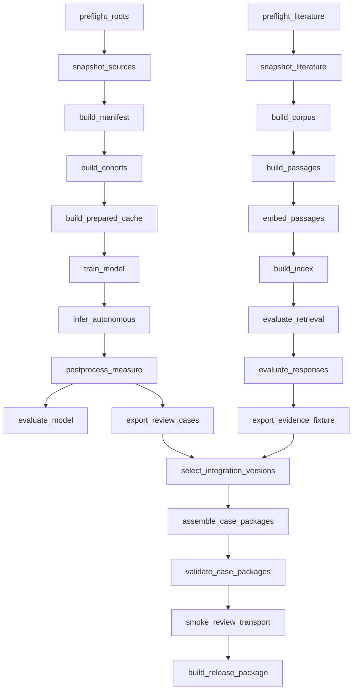

# Workflow orchestration

**Status:** Walkthrough complete; implementation authorization and scoped Plan 10 checks pending; Prefect selection awaits spike  
**Owner:** Quinton Evans  
**Target weeks:** 1 and 4  
**Depends on:** Plans 01/02 contracts; Plan 03/G2 for PANORAMA stages only; Plan 10 root, retention, and environment rules  
**Source requirements:** Approved proposal workflow-DAG commitment; artifact and run-manifest contracts  
**Last reviewed:** 2026-09-20 (walkthrough accepted; local-tool selection approach reaffirmed)

September 28 follow-up: **D-269 authorizes only the shared cohort-publication controls and S4
registry/resolver** after Quinton's continuation of that explicitly named next step. This satisfies
the coding gate for that bounded slice. The older general “not authorized” statements below remain
historical for this slice; other orchestration implementation and the Prefect trial remain gated.

## Required explanation gate

> **Explain to Quinn the function of this plan before writing any code.**

**Completed 2026-09-20:** Quinton confirmed he understands the system and could explain it to
someone else. The walkthrough covered all topics below, followed by Prefect and alternatives.
He approved Prefect-first evaluation, a four-hour selection trial, and the repository-runner
fallback. Temporary local Prefect machinery is acceptable if understood, tested, and isolated;
no cloud service or manually maintained server is required. This updates the earlier literal
"without a server" wording. D-201 remains open: no spike has run and Prefect is not locked.
The current request authorizes documentation updates and moving to stakeholder preparation,
not installation or Plan 04 coding. Explicit implementation authorization is still required.

Quinton approved the design choices in this plan on 2026-09-08, but intentionally deferred the
implementation walkthrough because workflow orchestration is the part of the capstone he currently
understands least. Design approval is not permission to begin Plan 04 code.

Before installing or testing an orchestration tool, writing schemas, building the runner, or wrapping
any existing command, walk through this plan with Quinton in plain language. The walkthrough must
cover:

- what problem the DAG solves and what it does not do;
- one concrete artifact moving from planning through execution, validation, and publication;
- the difference between Prefect's task status and PROWL's authoritative scientific evidence;
- what `plan`, `run`, `resume`, `inspect`, and `status` mean from the operator's perspective;
- how retries, interrupted writes, checkpoints, locks, and the external drive are handled; and
- what the bounded Prefect spike will prove before the final tool is selected.

Implementation may begin only after Quinton confirms that the explanation is complete and explicitly
authorizes Plan 04 coding. Record that confirmation in this file and in
[`../DECISIONS.md`](../DECISIONS.md).

## Outcome

PROWL will have a tested local workflow DAG that coordinates validation, manifests, cohorts,
preprocessing, training, autonomous inference, evaluation, literature indexing, case-package
assembly, and release preparation. It will be restartable after an interrupted process, laptop, or
external-drive connection; refuse invalid or incomplete inputs; reuse only independently verified
artifacts; and preserve a complete execution history. Prefect 3 is the time-boxed local orchestration
candidate. PROWL's versioned files, hashes, schemas, event log, and completion markers remain the
authoritative scientific state regardless of the orchestration tool.

## Why this belongs

The preceding project used capable scripts but required the operator to remember their order,
arguments, shared output locations, validation steps, and resume behavior. That contributed to
wrong-parent cohort selection, inconsistent train/evaluation overrides, overwritten keeper paths,
and an experiment that lacked its expected MLflow record. The approved capstone explicitly promises
a tested, restartable workflow DAG. Plan 04 turns that promise into enforceable stage contracts
without rewriting the scientific implementation or building a production scheduling platform.

## Core mental model

- The **DAG** is the declared dependency graph. It is not a synonym for Apache Airflow.
- A **stage** is a small orchestration wrapper around a scientific or data component owned by another
  plan. The wrapper resolves inputs, calls the component, validates outputs, and records evidence.
- A **workflow run** is one requested traversal of a named DAG using an immutable resolved
  configuration and exact input artifact references.
- A **stage attempt** is one execution try. Attempts are append-only evidence even when a later try
  succeeds.
- A **published artifact** is reusable scientific output. Prefect task state, a console message, or a
  process exit code cannot make an artifact complete.
- A **resume** reuses verified completed stages and continues from the earliest incomplete or invalid
  stage. It never guesses that an output is usable.

## Scope

- Imaging, literature, integration, and release DAG definitions.
- Stage registry, dependency edges, relevant configuration, resources, and retry classes.
- Local orchestration-tool spike and recorded selection.
- Run summaries, append-only stage-attempt events, logs, and completion/failure records.
- Derivation-key reuse, independent output validation, and descendant invalidation.
- Atomic publication, partial-output quarantine, cancellation, resumption, and stale-run recovery.
- Dry-run/explain, execute, resume, inspect, and status operator commands.
- External-root, capacity, environment, code-state, cohort, and contract preflights.
- Resource locks that prevent competing training processes or conflicting artifact writers.
- GitHub/Notion handoff summaries without making either system the runtime state store.

## Non-goals

- Apache Airflow. Quinton rejected it for this capstone on 2026-09-08.
- Prefect Cloud, a managed control plane, or uploading medical-image data or paths to an external
  orchestration service.
- Distributed scheduling, Kubernetes, worker fleets, multi-user queues, or always-on operation.
- Reimplementing preprocessing, modeling, metrics, retrieval, or UI logic inside the orchestrator.
- Passing CT arrays, model objects, checkpoints, indexes, or other large scientific payloads as
  serialized orchestration return values.
- Treating orchestration caching as a replacement for PROWL artifact identity and validation.
- Scheduling Notion or GitHub as dependencies of scientific execution.
- Automatically retrying invalid data, failed scientific assertions, or expensive training from
  scratch without an explicit recovery policy.

## Current state

### Reusable foundation

- `scripts/build_manifest.py`, `create_splits.py`, `train.py`, `evaluate.py`, `cascade_eval.py`,
  `export_case.py`, `register_model.py`, and related utilities already expose command-line entry
  points.
- Training has graceful interrupt/checkpoint behavior, a run-specific checkpoint archive, a run
  ledger, and optional MLflow tracking.
- Plan 01 defines derivation and content hashes, immutable artifact paths, temporary publication,
  and `run-manifest.schema.json` v1.0.
- Plans 02 and 03 define frozen cohort IDs, source snapshots, quarantines, and validation gates.
- Imaging, literature, and integration paths already have separate architecture boundaries.

### Gaps that orchestration must close

- Several inherited scripts still accept free-form file paths and write to shared historical paths.
- Configuration is resolved independently by different entry points, creating train/inference drift.
- Existing checkpoint resume is component-specific rather than one DAG-level recovery contract.
- There is no stage registry, graph validator, resource lock, dry-run plan, or workflow event stream.
- A successful process exit does not consistently prove schema validity, expected files, or hashes.
- MLflow records experiments but does not own source/cohort validation or artifact completeness.
- No literature or case-package DAG exists yet.
- Prefect is not currently a project dependency and must pass a bounded compatibility spike before
  selection.

## Inputs, outputs, and authority

| Input | Authority | Orchestration treatment |
|---|---|---|
| DAG definition and stage registry | Versioned PROWL configuration/code | Validate graph and component versions before a run ID is created |
| Resolved workflow configuration | Plan-owned configuration schemas | Freeze full file and hash the relevant subset for each stage |
| Source, manifest, cohort, model, corpus, and package references | Plan 01 artifact contracts | Resolve by artifact ID and verified hashes; never discover by `latest` or directory glob |
| Code identity | Git commit plus dirty-state evidence | Record commit; if dirty, record deterministic diff hash and warn in release-mode runs |
| Environment identity | Plan 10 environment lock/evidence | Record Python, platform, dependencies hash, device, and environment artifact |
| Root aliases | Plan 10 root registry | Preflight mounted path, permissions, capacity, and root identity without storing the absolute path as scientific identity |
| Stage-attempt events | Plan 04 append-only event contract | Preserve every start, retry, failure, reuse, completion, and cancellation |
| Published artifacts | Owning component plan | Accept only after component validation, content hashing, and completion publication |

The existing [`../contracts/run-manifest.schema.json`](../contracts/run-manifest.schema.json) remains
the workflow summary contract. Plan 04 adds an append-only stage-event schema so retries do not erase
earlier attempts. Detailed behavior is specified in
[`../orchestration/STATE-AND-RECOVERY.md`](../orchestration/STATE-AND-RECOVERY.md).

## Workflow graph

The authoritative stage table is
[`../orchestration/STAGE-REGISTRY.md`](../orchestration/STAGE-REGISTRY.md). The high-level paths are:

The graph declares potential dependencies. A named workflow selects the required subgraph. A
literature failure cannot invalidate a complete imaging artifact; an integration run waits for exact
selected imaging and evidence versions rather than coupling their original executions.

## Invariants

1. The registered dependency graph is acyclic and validated before execution state is created.
2. A stage completion state is written only after every declared output passes schema, integrity,
   lineage, and domain validation.
3. No run, retry, resume, framework cache, or convenience name overwrites a different published
   artifact.
4. Identical derivation inputs produce the same expected identity; a changed relevant input,
   configuration value, code identity, or component version produces a new identity.
5. A downstream stage consumes only exact published artifact references, never an attempt directory,
   partial file, `latest`, display name, or runtime directory glob.
6. Autonomous inference receives no ground-truth label, protected reference, or provided pancreas
   region. Evaluation references enter only the evaluation stage.
7. Patient images, source reports, imaging labels, and direct imaging identifiers never enter the
   literature workflow or an external orchestration/project-management service.
8. Prefect, MLflow, GitHub, and Notion cannot override PROWL artifact validity or completion.
9. Terminal runs and attempt events are immutable. Correction or recovery creates new linked
   evidence rather than rewriting history.
10. Unclassified failures and scientific validation failures are non-retryable by default.
11. Expensive compute cannot begin until its source, cohort, configuration, capacity, environment,
    and resource-lock preflights pass.
12. Removing or replacing the orchestration adapter does not change stage IDs, scientific artifact
    contracts, or derivation identity.

## Approved design decisions

| Ref | Recommendation | Why | Alternative/consequence |
|---|---|---|---|
| P04-01 | Use Prefect 3 in local execution as the time-boxed candidate; keep a contract-compatible in-repository runner as the automatic fallback. | Prefect supplies task dependencies, states, retries, timeouts, logs, and optional local visualization without requiring Airflow. | Selecting Prefect without a spike risks dependency and state friction; building the runner first duplicates capabilities before measuring the need. |
| P04-02 | Prohibit Prefect Cloud and a required manually maintained server. Temporary local machinery is acceptable only if understood and tested; the persistent local UI is optional. | September 20 clarification: PROWL evidence remains independently inspectable even if framework state is lost. | Temporary services still add lifecycle/state overhead; the spike must justify it. |
| P04-03 | Pass only validated artifact references and small status values between tasks. Never use Prefect result persistence or task caching for CTs, models, predictions, or indexes. | Large scientific files already have stronger versioned identity, integrity, and retention rules. | Passing large Python objects makes retries opaque, increases memory/storage risk, and ties artifacts to one framework. |
| P04-04 | Treat PROWL derivation hashes plus independent output validation as the only reuse decision. Prefect may report `Cached`, but PROWL records `reused` only after verifying the published artifact. | Prevents orchestration state from falsely certifying stale, missing, or corrupted output. | Trusting framework cache keys would omit domain validation and may not capture every scientific dependency. |
| P04-05 | Write each attempt beneath the destination artifact filesystem, validate it there, and publish through an atomic rename or completion record written last. Quarantine failed partials. | Atomic rename is not portable across filesystems; the 4 TB external drive must not receive a cross-volume pseudo-atomic move. | Writing on the laptop and moving afterward can expose partial artifacts after disconnect or copy failure. |
| P04-06 | Retry only classified transient failures. Schema, hash, cohort, label, geometry, privacy, and scientific assertion failures are non-retryable. Training resumes only from a validated checkpoint under an explicit attempt. | Repeating deterministic invalid work wastes time and can hide a scientific defect. | Blanket retries can launch expensive duplicate training or convert persistent faults into noisy logs. |
| P04-07 | Execute sequentially by default. Permit parallel work only for independent CPU/I/O stages with separate destinations; acquire an exclusive accelerator lock for training/inference and a writer lock per artifact family. | The workstation has one shared-memory GPU and external-drive bandwidth is finite. | General parallel scheduling risks MPS instability, memory pressure, and conflicting writes. |
| P04-08 | Keep imaging, literature, integration, and release as independently executable workflows joined only through selected artifact IDs. | Preserves the architecture boundary and lets one workstream progress when another fails. | One monolithic end-to-end flow would make a literature failure block model work and complicate resumption. |
| P04-09 | Provide `plan`, `run`, `resume`, `inspect`, and `status` operations. `plan` is mutation-free and shows the resolved graph, roots, inputs, outputs, derivation hashes, reuse decisions, locks, and estimated expensive stages. | Quinton can understand what will happen before compute or writes begin. | A run-only CLI makes hidden defaults and invalidation difficult to review. |
| P04-10 | GitHub records code/review/release identity and Notion communicates milestones, blockers, and evidence links. Neither triggers or overrides scientific stages in the committed system. | Keeps project management useful without making an external board part of reproducibility or recovery. | Allowing board state to control execution creates a second, weakly versioned runtime authority. |

Quinton approved P04-01 through P04-10 on 2026-09-08. P04-01 approves Prefect as the first
time-boxed candidate, not as the final orchestrator; it remains provisional until the spike in
[`../orchestration/TOOL-SELECTION.md`](../orchestration/TOOL-SELECTION.md) passes. P04-02 through
P04-10 are locked tool-independent boundaries.

## Stage contract

Every registered stage declares:

- stable `stage_id`, component version, owning plan, and callable/command adapter;
- upstream stage IDs and exact input artifact types;
- full output artifact types and controlling schemas;
- relevant configuration selector used in its derivation hash;
- preflight validator and post-execution validator;
- retry class, timeout/cancellation behavior, and checkpoint support;
- resource class, locks, expected storage root, and minimum-capacity calculation;
- deterministic/seed behavior and environment requirements;
- log/event locations and completion evidence;
- descendants invalidated when its derivation identity changes.

A stage wrapper may translate a contract into legacy CLI arguments, but the registry cannot bless a
legacy free-form split path, shared keeper path, or undocumented default.

## Authoritative state and reuse

The state hierarchy is:

1. schema-valid published artifacts with matching content and derivation hashes;
2. terminal PROWL completion/failure records and the append-only stage-event log;
3. the current atomic `run.json` summary;
4. Prefect's local state/UI;
5. console output.

Higher levels resolve conflicts. A green Prefect task with a missing checksum is failed. A valid
published artifact remains reusable after a Prefect database loss. MLflow remains the experiment and
metric tracker; it does not certify DAG completion.

## Retry, interruption, and resume policy

- Before executing, compute the stage derivation hash and search only the expected canonical
  artifact identity.
- If a matching complete artifact validates, record `reused` and do not execute.
- If the path exists but content, schema, or derivation validation fails, quarantine the conflict and
  fail closed.
- Every execution creates an append-only attempt event and a run-scoped temporary directory.
- A retryable failure may receive the configured bounded retry count. Each retry is a new attempt.
- A non-retryable failure terminates the affected workflow path and leaves independent paths valid.
- SIGINT requests cooperative cancellation. Training finishes its safe checkpoint boundary when the
  component supports it; the workflow never invents a completion marker.
- Resume revalidates every upstream artifact, lock, root, environment, and selected configuration.
- A valid training checkpoint may continue within a new recorded attempt; an invalid checkpoint
  requires a new model attempt rather than reconstruction by guess.
- A terminal failed workflow is immutable. A later recovery run references it as `resume_of` and
  reuses its independently valid artifacts.

## Tool-selection spike

The Prefect spike is limited to four focused hours and three inexpensive synthetic/local stages:

1. validate a synthetic source snapshot;
2. build a tiny manifest-like artifact;
3. summarize that artifact into a report.

It must demonstrate an identical second run, one injected mid-write failure, quarantine of partial
output, resume from the last valid artifact, missing-root behavior, log/event export, and operation
without Prefect Cloud. Prefect is selected only if it wraps existing functions without invasive
rewrites and its installation does not destabilize the documented environment. Otherwise the same
stage contracts run through the fallback repository runner. Airflow receives no spike.

## Implementation sequence

1. **Complete:** Quinton approved P04-01 through P04-10 on 2026-09-08.
2. **Walkthrough complete September 20.** Obtain and record separate explicit authorization to
   begin Plan 04 coding; this documentation update does not grant it.
3. Validate the stage registry graph, unique IDs, dependencies, owning plans, and artifact types.
4. Add the append-only workflow-event schema and extend the run-manifest summary with DAG identity,
   selected stages, orchestration identity, and `resume_of` linkage.
5. Add the configuration schema for workflows, stage selectors, retry classes, locks, and roots.
6. Implement the tool-neutral stage context, artifact resolver, validator interface, event writer,
   atomic publisher, and resource-lock interface.
7. Run the time-boxed Prefect spike and record D-201. If it fails its bar, implement the small runner
   against the same interfaces.
8. Build the `plan` and `inspect` paths before allowing execution.
9. Wrap three cheap real components: source preflight, contract validation, and a metadata/manifest
   adapter. Remove or block hidden shared-output behavior at their boundary.
10. Test same-input reuse, configuration invalidation, root loss, write interruption, and resume.
11. Add imaging stages in dependency order. Use synthetic fixtures until each real-data stage's
    own G1/Plan 05/06/09/10 gates pass; G2 additionally gates PANORAMA/mixed-source stages, not
    PanTS-only work. G3 still requires tested control/recovery behavior before expensive baseline runs.
12. Add literature stages against synthetic or permitted small fixtures.
13. Add integration stages using contract examples before live model/evidence artifacts.
14. Execute imaging and literature smoke DAGs twice; inject an interruption and complete a recovery
    run.
15. Publish G3 evidence and update decisions, risks, traceability, operator documentation, and Plan
    05–08 handoffs.

No full model training is part of the orchestration implementation test. G3 proves control behavior
with inexpensive fixtures before expensive baseline work.

## Test matrix

| Level | Scenario | Expected result |
|---|---|---|
| Graph | Duplicate stage ID, cycle, missing dependency, or undeclared artifact type | Planning/validation fails before a run directory is created |
| Config | Stage reads a value outside its declared relevant selector | Contract test fails or selector/version is expanded before execution |
| Plan | Mutation-free plan of a mixed workflow | Shows exact stages, roots, inputs, outputs, derivations, reuse, locks, and expensive boundaries |
| Reuse | Same complete run requested twice | Second run independently validates outputs and records `reused`; no logical output duplicates |
| Invalidation | One preprocessing value changes | Cache and descendants receive new derivation IDs; source/manifest/cohort remain reusable |
| Integrity | Expected artifact path exists with wrong content hash | Conflict quarantined; stage does not overwrite or reuse it |
| Atomicity | Process killed while writing output | No completion record; partial remains attempt-scoped/quarantined and cannot be consumed |
| Resume | Recovery run follows injected failure | Valid upstream artifacts reused; execution starts at earliest incomplete stage |
| Retry | Temporary read/connection error | Bounded retry creates a new attempt event and succeeds or ends clearly |
| Fail closed | Invalid cohort, schema, geometry, label value, privacy rule, or checksum | No retry and no downstream launch |
| Root | Required external drive missing or wrong root identity | Preflight fails before expensive compute with actionable alias/path guidance |
| Capacity | Forecasted stage output exceeds configured free-space reserve | Stage is blocked before writing |
| Lock | Second training run starts while accelerator is held | Second run waits/fails clearly; no concurrent MPS training |
| Separation | Literature stage fails | Imaging workflow and completed imaging artifacts remain valid |
| Framework | Prefect database/UI is unavailable after valid artifacts exist | Direct inspection and future reuse still work from PROWL records |
| Training | Interrupted training has a validated checkpoint | Recovery attempt names checkpoint lineage; no false model completion |
| Cancellation | Cooperative stop requested | Running stage stops at its declared safe boundary; pending stages do not launch |
| Regression | Wrapper tries to pass an arbitrary legacy split file | Cohort resolver rejects it before component launch |
| Repeatability | Same fixtures/config/code run in a fresh attempt | Artifact hashes, stage decisions, and graph order match |

## Failure modes, detection, prevention, and recovery

| Failure | Detection | Prevention | Recovery |
|---|---|---|---|
| Prefect installation conflicts with MONAI/MLflow environment | Dependency resolution or smoke import fails | Isolated spike and locked environment evidence | Reject Prefect; use repository runner or isolated orchestration environment calling stable CLIs |
| Prefect state disagrees with artifact state | Green task but artifact validation fails, or local DB is lost | PROWL truth hierarchy and post-stage validation | Mark stage failed in PROWL evidence; rebuild or reuse only independently valid artifacts |
| Framework setup becomes a project | Four-hour spike expires without passing | Timebox and binary selection bar | Stop spike and implement minimal runner against frozen contracts |
| External drive disconnects | I/O error, root heartbeat/preflight change, incomplete write | Destination-local attempts, checksums, atomic completion, bounded reads | Reconnect verified root; quarantine partial; resume from last valid artifact |
| Cross-volume publication is not atomic | Device IDs differ or rename degrades to copy | Attempt directory created under destination artifact root | Copy inputs into destination attempt if required, validate, then destination-local rename |
| Training is launched twice | Accelerator lock conflict or process identity check | Exclusive resource lock and run preflight | Keep valid owner; cancel/quarantine duplicate attempt and inspect checkpoints |
| Stale lock blocks recovery | Recorded owner process/host no longer exists | Lease/heartbeat plus owner metadata | Explicit stale-lock inspection and release event; never delete an active lock blindly |
| Automatic retry repeats scientific failure | Error classification shows deterministic validation fault | Allowlist retryable classes | Stop path, preserve evidence, correct input/config in a new run |
| Existing CLI ignores declared output path | Postcondition finds shared-path write | Wrapper sandbox and explicit output contract test | Patch CLI/adapt function before registry promotion |
| Event or run summary is interrupted | Invalid temporary JSON or missing atomic replacement | Append/fsync event then atomically replace summary | Rebuild summary deterministically from append-only events |
| Notion/GitHub unavailable | Project link update fails after scientific completion | External updates occur after artifact publication | Queue a human-readable summary; scientific run remains complete |

## Observability and evidence

Every workflow run exposes:

- run ID/name/type, DAG version/hash, selected stages, parent/recovery run, and terminal status;
- code commit, dirty/diff hash, environment/dependency hash, host/device, and root aliases;
- complete resolved configuration plus per-stage relevant configuration hashes;
- ordered stage attempts with start/end time, duration, outcome, retry classification, and logs;
- exact input/output artifact IDs, content hashes, derivation hashes, schema versions, and byte counts;
- reuse and invalidation explanations;
- lock acquisition/release, root preflight, capacity forecast, and resource-use summary;
- quarantined partials/conflicts and their permitted cleanup status;
- Prefect flow/task identifiers when Prefect is selected, without relying on them for lineage;
- MLflow run ID for experiment stages and GitHub/Notion evidence links where applicable.

The operator guide must answer: what will run, what is running, what completed, what was reused, what
failed, why it failed, whether retry is safe, where the logs are, and exactly how to resume.

## Plan readiness gate

Plan 04 may move to `Ready` when:

- [x] Quinton approves P04-01 through P04-10 (2026-09-08).
- [x] Imaging, literature, integration, and release stage graphs are specified.
- [x] Artifact authority, idempotency, publication, retry, recovery, and concurrency rules are
      specified independently from the tool.
- [x] The stage registry, state/recovery contract, and tool-selection spike plan exist.
- [x] Workflow-event and revised run-manifest fields are accepted as the planned machine-readable
      contract (2026-09-08); their schemas still require implementation and testing.
- [x] Quinton receives and accepts the required plain-language walkthrough (2026-09-20).
- [ ] Quinton explicitly authorizes Plan 04 coding.
- [ ] Plan 10 confirms root alias, capacity reserve, retention, lock, and environment boundaries used
      by the preflight contract, or names an implementation-safe fallback.

The tool-independent design is approved, but Plan 04 is not yet `Ready` for implementation because
implementation authorization and scoped Plan 10 prerequisite review remain open. After Quinton authorizes coding, the
Prefect spike is an implementation-selection gate inside Plan 04; D-201 remains open until measured
evidence selects Prefect or the fallback.

## Completion gate (G3)

- [ ] D-201 records the selected tool and spike evidence.
- [ ] Run-manifest summary, workflow events, stage registry, and configuration validate against
      versioned schemas.
- [ ] `plan`, `run`, `resume`, `inspect`, and `status` behavior is documented and tested.
- [ ] Imaging and literature smoke workflows pass twice with identical artifact decisions.
- [ ] Injected mid-write failure produces no consumable partial and recovery starts correctly.
- [ ] Changed relevant configuration invalidates only the affected stage and descendants.
- [ ] Invalid cohort/hash/schema input prevents training launch.
- [ ] Missing/wrong external root and insufficient-capacity preflights fail before compute.
- [ ] Exclusive accelerator and artifact-writer locks pass conflict and stale-owner tests.
- [ ] Prefect/local-state loss does not prevent validation or reuse of complete PROWL artifacts.
- [ ] No stage overwrites a different completed artifact or accepts a free-form legacy cohort list.
- [ ] Operator guide and G3 evidence link logs, events, hashes, failure, resume, and repeat-run results.
- [ ] Decisions, risks, traceability, and Plan 05–08 handoffs are updated.

## Rollback and fallback

- Orchestration is additive under `outputs/prowl/workflows/`; it does not rename or overwrite
  historical outputs, scripts, checkpoints, or MLflow records.
- Stage wrappers call stable component interfaces. Removing Prefect does not change artifact IDs,
  schemas, stage contracts, or operator semantics.
- If Prefect fails the spike, the repository runner executes the same topologically sorted registry,
  event writer, validators, locks, and publisher.
- If a legacy component cannot yet meet atomic-output rules, it remains outside the trusted DAG and
  may be invoked only as an explicitly historical/manual step.
- If full PANORAMA sources are not mounted, use synthetic fixtures and the eventual G2 smoke cohort;
  do not weaken source validation to make the workflow appear complete.
- If training resume remains unreliable, the DAG may record a controlled manual checkpoint launch;
  it may not claim automated recovery or mark G3 complete for that scenario.

## Planned artifacts

- [`../orchestration/README.md`](../orchestration/README.md)
- [`../orchestration/STAGE-REGISTRY.md`](../orchestration/STAGE-REGISTRY.md)
- [`../orchestration/STATE-AND-RECOVERY.md`](../orchestration/STATE-AND-RECOVERY.md)
- [`../orchestration/TOOL-SELECTION.md`](../orchestration/TOOL-SELECTION.md)
- Revised `run-manifest.schema.json` and example.
- `workflow-event.schema.json` and stage-registry/workflow-configuration schemas with examples.
- Tool-neutral stage context, artifact resolver/validator, publisher, event writer, and lock layer.
- Prefect adapter or fallback repository runner.
- Operator guide for plan, execute, inspect, cancel, and resume.
- Failure-injection, repeatability, invalidation, and framework-loss reports linked from G3.

## Handoff

Plan 05 may attach autonomous imaging components only after G3 proves that invalid cohort and source
inputs cannot launch expensive compute. Plan 07 may attach corpus/index stages without sharing
imaging state. Plan 08 consumes only validated selected versions. Plan 10 must freeze storage roots,
capacity reserves, environment isolation, and retention before high-volume or expensive stages run.
