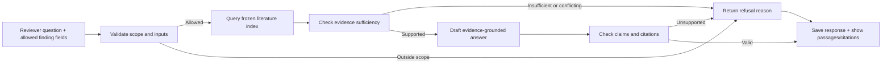

# PROWL feature and delivery outline

**Prepared:** October 9, 2026, America/Denver  
**Status:** Scope confirmed; guided questions and saved fixture responses selected and implemented locally  
**Purpose:** Recenter on the approved commitments, recognize completed work, and choose useful next work.

This is a readable scope and schedule guide. The existing Week 1 and Week 2 work plans remain the
living task boards; this document creates no competing execution queue. It does not launch work,
change the approved scope, or mark the capstone complete.

## 1. What we are building

PROWL takes an abdominal CT, locates the pancreas, proposes pancreas and suspected-lesion contours,
calculates review measurements, and presents them in the existing medical-image viewer. The reviewer
can inspect the result, ask a literature question, see supporting passages/citations or an explicit
refusal, and record acceptance, a correction requirement, or rejection against that prediction version.

The project must deliver a coherent, reproducible review workflow and an honest evaluation. Better
model performance is a research objective; a particular Dice score or successful modeling technique
is not a completion promise.

Governing sources read for this draft:

- [Approved proposal v3.8](../../../Evans_Quinton_PROWL_Capstone_Proposal_v3.8.docx), especially sections 2–6.
- [Approved technical appendix v3.1](../../../Evans_Quinton_PROWL_Capstone_Technical_Appendix_v3.1.docx), A2–A9.
- [Approved source records](../../../references/governance/APPROVED-SOURCES.md): both file hashes match.
- [Master plan](../MASTER-PLAN.md) and [43-requirement baseline](../REQUIREMENTS-TRACEABILITY.md).
- [D-260 evidence database decision](../operations/POSTGRES-PGVECTOR-DECISION-2026-09-28.md): PostgreSQL + pgvector
  is selected for literature; canonical files remain the rebuild authority. Imaging stays file-first.

A v3.9 proposal exists. Its differences add GitHub/Notion project-management language and weekly
reconciliation, not a different feature set or ten-week schedule. The recorded approved authority is
still v3.8; this draft does not silently promote v3.9 or replace the later Trello working practice.

## 2. Where we are at the Week 1 / Week 2 transition

Week 1 is October 5–11; Week 2 is October 12–18. October 9 is still Week 1. Early implementation
can satisfy later milestones, but we should judge Week 1 against its own architecture/test deliverable.

| Area | Evidence now | Remaining delivery work |
|---|---|---|
| Architecture and scope | Twelve approved component designs, contracts, risk/traceability documents and test strategy | Reconcile current status and a small Week 1 closeout; avoid another broad design cycle |
| Training | New full session/executor architecture; Mac run reports 24,000 updates; Lenovo training/data readiness reported by Quinton | Review Lenovo's actual handback when available; evaluate its result and controlled successor |
| Autonomous imaging | CT-only localizer → predicted region → segmenter → original-coordinate masks; 68/75 development cases produced outputs | Seven missing-unit cases remain explicit failures; contour quality and flagged anatomy/source concerns remain |
| Evaluation | Matched native comparisons and crop diagnostics; reusable predict/score/compare CLI with 24 focused synthetic/scoring tests | Bind future experiments to the fixed cohort; finish operating-point, subgroup and formal held-out reporting |
| Cohorts | Protected identity, manifest, cohort publication/consumption code and frozen 1,333-train/75-development membership | Verify the exact consumers across Mac/Lenovo roots; document biological-patient identity limits |
| PANORAMA | Acquisition and source/mapping planning exist | Source reconciliation, actual eligibility/mapping/duplicates and tested integration remain Week 3 work |
| AI literature expert | Approved workflow/query/response contracts; synthetic query/passages/metrics and native binding evidence | Latest retained October 6 handback leaves actual storage rehearsal open; no live evaluated corpus/index/answer service established here |
| Review application | Existing React/NiiVue viewer and prior UI test evidence | Connect current predictions/measurements, literature outputs and durable review history; qualify the full flow |
| Whole-system DAG | Stage registry, dependencies and recovery design exist; individual training recovery works | Full cross-stage execution/reuse/failure-resume integration remains to implement and qualify |

Evidence: [Week 2](WEEK-02-WORK-PLAN.md), [autonomous results](../imaging/AUTONOMOUS-CHECKPOINT-CONNECTION-2026-10-09.md),
[evaluator guide](../../evaluation-autonomous-cohort.md), [retrieval handback](../operations/PLAN07-V13-HANDBACK-2026-10-06.md),
[UI foundation](../testing/UI-FOUNDATION-2026-09-20.md), and the repository modules named in section 5.
This review uses retained evidence; it did not rerun old suites or inspect Lenovo remotely.

**Week 1 assessment:** The core design package is present, and imaging implementation is well beyond
what Week 1 requires. Formal closeout is not yet recorded. The remaining closeout is an evidence and
priorities review, not a requirement to finish the AI expert, a production DAG, or the entire viewer.

Close only these Week 1 items:

- Review this current architecture/component map and identify any actual design contradiction.
- Associate the required Python/UI development commands with applicable existing evidence; address a
  concrete missing/failed check if found rather than repeat all historical tests.
- Confirm the next implementation slices and their finish conditions, including the expert's current owner/status.
- Confirm course submission/presentation status and human-hour exclusions with Quinton; prepared files
  and unattended runtime are not proof of submission or human work.
- Record the Week 1 closeout and selected Week 2 priorities in the existing weekly plans.

Current real-data results are development evidence. SuPreM membership and biological patient independence
remain unresolved; reference-empty annotations do not prove clinical health. These limits affect the
claims and evaluation population, not the ability to plan or build independent software components.

## 3. Complete committed feature inventory

These are user capabilities and required engineering deliverables, grouped for discussion. Existing
code should be connected or completed before a replacement is considered. Parentheses identify the
main scheduled delivery window, not a prohibition on earlier work.

### Imaging data and preparation

- Import/validate CT and source metadata, with explicit missing, invalid and unsupported-input outcomes. (Weeks 2–4)
- Maintain source/case/group identities, manifests, original-file hashes, annotation provenance and acquisition metadata. (Weeks 2–3)
- Freeze training/development/test roles; enforce overlap, grouping, role-use and repeatability checks. Record identity limits. (Week 2)
- Resolve machine-local paths without changing membership or content identity; preserve the same admitted cases on both machines. (Week 2)
- Integrate PANORAMA label mappings, declared-import exclusions, duplicate controls, source-quality and negative-reference definitions. (Week 3)
- Build reproducible, versioned prepared inputs/caches while preserving original files and spatial transforms. (Weeks 3–4)

### Autonomous imaging and measurements

- Locate the pancreas from the full CT without a supplied reference box. (By Week 5; working development path exists)
- Segment pancreas and suspected lesions using the selected new capstone model; preserve multiple lesion candidates. (By Week 5)
- Restore masks to the original CT grid and record model/config/transform identity. (By Week 5; working path exists)
- Produce organ/lesion measurements and structured findings, with validity/warning states. (Weeks 4–7)
- Produce and evaluate a review-ordering score; keep score meaning and uncertainty visible. Use neutral ordering until justified. (Weeks 5–7)
- Report empty localization, missing units, invalid geometry, processing failures and out-of-scope input concerns explicitly. (Throughout)

### Model learning and evaluation

- Train new capstone models with versioned settings, seeds, checkpoints, backups and supported continuation. (Continuous eligible work; Lenovo execution)
- Establish a fixed autonomous baseline and a separately labeled provided-region diagnostic. (Week 5)
- Measure pancreas/lesion overlap separately, detection/false-alarm operating curves, missed lesions, subgroups, uncertainty and resource cost. (Weeks 5–6, final Week 8)
- Complete at least one hypothesis-driven controlled model comparison with matched evaluation and an adopt/reject/inconclusive decision. (Week 6)
- Preserve failed cases, null results and experiment history; freeze final selection before held-out release evaluation. (Throughout, final Week 8)

### AI expert: literature evidence assistant

- Acquire permitted PubMed/PMC metadata and text with source versions, rights, corrections/retractions and exclusions. (Foundation through Week 5)
- Normalize documents into stable passages with exact source locators and freeze a reproducible corpus. (By Week 5)
- Build a local searchable literature store/index; measure lexical, vector and hybrid retrieval configurations. (Weeks 5–6)
- Construct a bounded query from the reviewer's question and permitted non-identifying finding fields. (Design now; implementation through Weeks 5–7)
- Retrieve and rank passages, deduplicate evidence, and retain passage/corpus/index identity. (Weeks 5–6)
- Return an evidence-supported summary with citations attached to claims, or a clear insufficiency/conflict/out-of-scope refusal. (Weeks 6–7)
- Show source passages/citations and answer limitations in the review interface. Retrieval unavailability must not prevent image review. (Week 7)
- Evaluate recall@k, MRR, citation integrity, groundedness, completeness, refusal accuracy and latency on frozen questions. (Weeks 6–8)

### Reviewer application

- Extend the current React/NiiVue workspace with a case worklist and case/model/prediction identity. (Incrementally; integrated Week 7)
- Display aligned CT, pancreas and lesion overlays with existing slice/3D, layer and visibility controls. (Incrementally; integrated Week 7)
- Show measurements, review score or neutral ordering, warnings and processing state. (Week 7)
- Handle loading, missing, failed, stale and unavailable results; keep reference overlays explicitly in validation/demo mode. (Weeks 7–8)
- Connect reviewer questions to evidence results and inspectable citations. (Week 7)
- Persist accept / correction-required / reject actions against an immutable prediction version, including reloadable history. (Week 7)
- Serve the same validated case-package/view-model contract through the selected static/API transport. (Weeks 4–8)

`Correction-required` records that contours need editing. Browser voxel editing is optional unless
separately selected after the core is complete; a review button alone does not promise an editing tool.

### Workflow, reproducibility and delivery

- Define executable stage dependencies for imaging, literature preparation, evaluation and package assembly. (Design Week 1; execution Week 4 onward)
- Track stage attempts and reuse only valid completed outputs; safely restart after an injected failure or interruption. (Week 4)
- Keep scientific inputs/outputs tied to data, code, model, configuration and environment versions. (Throughout)
- Provide documented environments, logging, resource budgets, keeper backup and tested recovery. (Throughout)
- Add targeted unit/data-quality/integration tests with each component; complete regression and end-to-end verification. (Throughout; full matrix Week 8)
- Conduct a real stakeholder walkthrough, record findings and implement selected bounded improvements. (Week 7; arrange participation by Week 5)
- Deliver source/configuration, model/evaluation documentation, data/corpus lineage, user/developer guides, risk/ethics record and reproducibility instructions. (Draft Week 8; final Week 10)
- Provide a stable demonstrable release, demo recovery plan, presentation and submission package containing permitted materials. (Weeks 9–10)
- Maintain weekly priorities, evidence-linked task status and user-supplied human-hours records. (Every week)

### Optional choices and stretch work

Additional architectures, classifiers/specialist routing, ensembles, distillation, extra model
comparisons, PanTS narrative text, broader literature, richer generated reports, browser contour editing,
external evaluation/submission and rented compute are choices or stretch opportunities. They are not
all separate promised features. Each needs a measured reason, a bounded scope and room before Week 9.
The proposed Lenovo crop-variation successor addresses a measured error; it does not commit us to every
alternative in the investigation document. Long Mac training, another viewer redesign and project-wide
database migration are not current priorities.

## 4. Weekly deliveries

The approved schedule completes the committed system by Week 8. Week 9 protects stabilization and
Week 10 protects delivery. Daily implementation can overlap these workstreams when dependencies permit.

- **Week 1 — October 5–11: Architecture and test planning.** Deliver the agreed architecture, data and
  retrieval requirements, workflow design, UI-extension requirements, acceptance criteria and test plan.
  Closeout now: reconcile the evidence and choose Week 2 work. A finished trained product is not due.
- **Week 2 — October 12–18: Protected cohorts.** Deliver reproducible frozen case lists/manifests with
  passing grouping, disjointness, role-use and repeatability checks. Include portable consumption and
  explicit identity limits. Early expert-DAG or viewer work can accompany this primary deliverable.
- **Week 3 — October 19–25: PANORAMA integration.** Deliver tested label remapping, provenance,
  import/duplicate exclusions, reconciliation counts and a valid mixed-source smoke input.
- **Week 4 — October 26–November 1: Unified pipeline and DAG.** Deliver reproducible training inputs
  and a tested executable workflow that can reuse valid stages and recover from an injected failure.
  Individual checkpoint resume is useful evidence but does not alone satisfy cross-stage recovery.
- **Week 5 — November 2–8: Autonomous baseline and retrieval prototype.** Deliver the new autonomous
  held-out baseline with error analysis, plus a versioned queryable literature prototype. Select the
  experimental question from errors; confirm the stakeholder session/fallback by this point.
- **Week 6 — November 9–15: Controlled comparison and measured retrieval.** Deliver the model decision,
  detection/false-alarm operating results and retrieval metrics. Develop and test cited-answer/refusal behavior.
- **Week 7 — November 16–22: Integrated reviewer workflow and stakeholder review.** Deliver inspect →
  evidence → accept/correction-required/reject with persistent history and recorded stakeholder findings.
- **Week 8 — November 23–29: Full integration and evaluation.** Deliver the end-to-end demonstration,
  passing required unit/integration/regression tests, final frozen held-out metrics, retrieval/response
  evaluation, documentation drafts and a release candidate. Core paths must be demonstrable without ad hoc repair.
- **Week 9 — November 30–December 6: Buffer and stabilization.** Resolve priority defects, rerun only
  affected checks/evaluation, rehearse recovery and lock the release. Add no new features or exploratory experiments.
- **Week 10 — December 7–13: Delivery.** Complete the permitted submission package, model card,
  user/developer guidance, presentation and rehearsed stable demo. Only packaging/presentation corrections remain.

The Week 5 baseline uses the approved training-separated evaluation roles; it is not permission to
open the final protected test set before its planned freeze/evaluation.

These are technical milestone dates. Actual course-assignment due dates and submission receipts are
separate; this draft does not invent or submit them.

## 5. Where the AI expert DAG fits now

Here, “AI expert” means the approved literature evidence assistant. The whole-system imaging DAG is
also required, but its data-preparation/training stages are a different flow from answering a question.
If “expert” is intended to mean a classifier or specialist segmentation model, that is a separate
candidate modeling experiment and should be named before choosing it.

The existing [stage registry](../orchestration/STAGE-REGISTRY.md), [Plan 04](../implementation/04-workflow-orchestration.md)
and [Plan 07](../implementation/07-literature-retrieval.md) supply the starting design.
A useful early task is to turn the assistant's existing design into one small, inspectable response flow:

A separate preparation DAG feeds that index: permitted source acquisition → normalized documents →
stable passages → frozen corpus → searchable index → retrieval evaluation. A query should not rebuild
the corpus or train a model. Imaging produces review findings independently; it does not receive
patient-specific diagnoses or reference masks from the assistant.

**Existing pieces to reuse:** `src/retrieval/query.py`, `passages.py`, `context.py`, `records.py`,
`labels.py`, `metrics.py`, the retrieval schemas and the existing UI evidence contracts. Query scope
rules are presently a fixture-level demonstration, not a validated semantic safety classifier.
The latest retained retrieval handback must be reconciled before duplicating its operational work.

**Proposed first expert-DAG deliverable:** a node/input/output table, answer/refusal/unavailable states,
and three representative paths: supported question, insufficient evidence, and out-of-scope request.
After we select implementation, a fixture-backed vertical slice could demonstrate these paths using
existing contracts. It would not claim a live corpus or measured answer quality. Framework evaluation,
database deployment and real corpus acquisition are separately sized implementation choices.

This can begin before Week 5 and does not depend on a better segmentation score. The Week 5/6 dates
are delivery milestones, not instructions to postpone all literature work until then.

### October 9 walkthrough: the three primary response paths

The discussion follows the existing Plan 07 response contract and Plan 08 evidence interaction.
The initial interface uses guided reviewer question intents and one saved response per request.
Each DAG node is a software operation; it need not be a separate AI agent or model call.

| Operation | Receives | Produces |
|---|---|---|
| Validate request | Reviewer question/intent and permitted non-identifying finding fields | Validated request or a named input/scope outcome |
| Construct query | Validated request and query-policy version | Reproducible literature search query |
| Retrieve evidence | Query and selected corpus/index version | Ranked passages with exact source/locator identities |
| Assess sufficiency | Question and retrieved evidence | Supported concepts, gaps/contradictions, and answer/refusal decision |
| Compose response | Supported question/context and selected passages | Short claims mapped to supporting passage IDs |
| Validate response | Claims, citations and their exact retrieved passages | Accepted response, extractive fallback, or refusal |
| Save/display | Validated outcome and lineage | Response artifact, visible state and inspectable sources |

**Path 1 — Supported answer.** Example intent: “What does the literature say about the limitations
of AI-generated pancreatic lesion contours?” Validate scope, retrieve passages, verify relevant support,
compose cited claims, check them and display the answer with exact passages. Completion evidence must
show that citations resolve into the selected corpus and displayed claims are supported. A plausible
answer or high similarity score alone is insufficient.

**Path 2 — Insufficient evidence.** The question is in scope, but retrieved passages do not support
its required concepts. Return `insufficient_evidence` with an understandable gap statement. Related
passages may be shown as related reading only; they must not be presented as supporting an answer.
Do not silently browse more sources or expand the corpus during the request. If only a separable part
is supported, the existing `partially_answered` state permits only that portion, with the unanswered
portion explicit. Contradictory evidence may be summarized with citations where supported; unresolved
conflict blocks a definitive conclusion.

**Path 3 — Out of scope.** Example: “Is this patient's lesion malignant?” Return `out_of_scope`
before retrieval/generation for the prohibited request, explain the assistant's literature-review
boundary, and optionally offer a clearly different general literature question for the reviewer to select.
Do not silently rewrite and answer it as though the original request were satisfied.

**Operational failure is a separate state.** If the index/service is unavailable or response validation
cannot complete, report `unavailable` or the existing validated fallback as appropriate. A technical
failure is not evidence that literature is absent. Image viewing and review remain usable. The UI also
needs a visible loading state; this does not introduce another scientific response outcome.

Discussion proposal for the first implementation slice: demonstrate the request-to-response path using
existing contracts and fixed permitted/synthetic passages for supported, insufficient and out-of-scope
fixtures, plus an unavailable-service fixture. Verify citation resolution, explicit states and preserved
imaging usability. This demonstrates workflow behavior; real retrieval/generation quality remains its
own subsequent evaluation. No implementation or new dependency is selected by this walkthrough.

## 6. Choosing today's work — discussion options

We are planning in this conversation now. No new feature implementation is selected by this draft.
Suggested discussion timeboxes below are planning aids, not recorded human hours or delivery estimates.

| Option | Purpose | Concrete finish line | Suggested initial timebox |
|---|---|---|---|
| Week 1 closeout | Make current progress legible | Agree the current status map, list only actual closeout gaps and choose Week 2 outcomes | 30–45 minutes |
| AI expert DAG | Advance a visible committed capability | Agree the response graph, inputs/outputs and three example paths; reconcile existing retrieval ownership | 60–90 minutes |
| Portable cohort consumption | Secure Week 2's primary commitment | Inspect current consumers/Lenovo handback; identify the exact missing root/identity checks, or show existing checks already cover them | 60–90 minutes for gap review |
| Saved prediction in viewer | Connect current model work to the product | Specify one current prediction package, viewer adapter and loading/failure states | One bounded specification; implementation selected afterward |

**Recommendation for discussion:** finish the compact Week 1 review, then choose the AI expert DAG
as today's main planning topic if that is where Quinton wants to regain product visibility. Keep
portable cohort consumption as Week 2's main engineering obligation. My earlier portability recommendation
was a dependency recommendation; it does not mean it must consume today or block all expert/UI design.

## 7. How we keep work focused

- Keep one primary Mac implementation task and at most one bounded secondary task, with a visible finish line.
- Lenovo continues the agreed training lane; Quinton relays its state/results. Mac does not infer live remote status.
- Begin a task by stating its user-visible purpose, weekly commitment, reused code and completion evidence.
- At the end of a work block, report what changed, what the evidence proves, what is still open and the next choice.
- Reuse valid prior evidence. Rerun checks when inputs/code changed, evidence is missing, or a specific failure warrants it.
- Write new infrastructure only when it removes an identified blocker or directly satisfies a committed capability.
- Preserve the existing plans as references, but use the living weekly plan to decide active work.
- Perform Sunday review; protect Week 9 and Week 10 from scope expansion.

October 9 follow-up: Quinton confirmed the scope and selected the AI expert DAG walkthrough.
Training belongs entirely to the other laptop/chat; this chat tests candidate models when supplied.
Trello is required for grading/work logging. Notion remains a brainstorming option.
Quinton selected guided reviewer questions and one saved response per request, with explicit uncertainty,
scope refusals and technical failure messages. The local [fixture demonstration](../retrieval/GUIDED-FIXTURE-DEMO.md)
implements that first slice; [W01-30](https://trello.com/c/3qTiK9p4) records delivery evidence.
Live retrieval/generation and partial/conflicting-evidence demonstrations remain future work.
Decisions still for discussion: the latest retrieval handback and Week 1's course-submission/hour
confirmations. None requires another broad architecture rewrite before useful development can continue.
